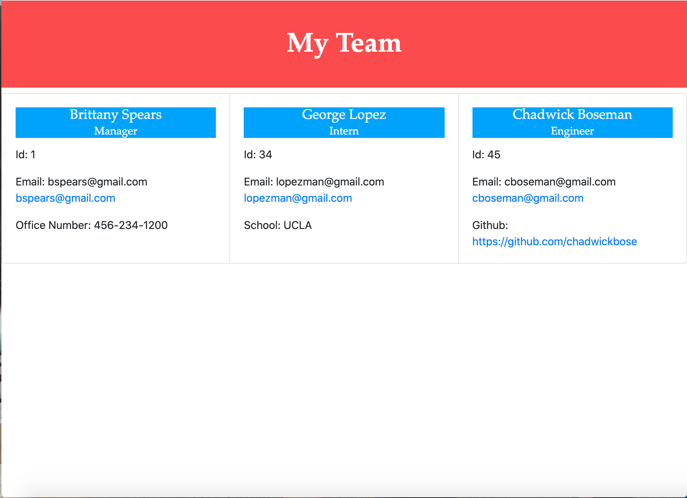

# Team Portfolio Generator

## Description
I wanted a backend application that allows a software engineering team to make a portfolio of their employees, with their contact information, so that everyone's titles and info would be in one place. I developed it using Node.js and Jest to run tests. The most challenging aspect was generating the HTML to include the data in my array that saved user's input to questions about the employees.

## Table of Contents
* [Installation](#installation)
* [Usage](#usage)
* [Contributing](#contributing)
* [Tests](#tests)
* [Questions](#questions)

## Installation
To install necessary dependencies, run the following command:
npm i
  
## Usage
Please clone the repo to your computer.  You will need to install inquirer from the command line using "npm install inquirer."  Then type "node index" in the command line and the application will run.  For a walk-through video, click [here](https://drive.google.com/file/d/1LNyzxLAcLEy9W6isX0HE8jZp-NCyRpbV/view).

## Contributing
Feel free to change the css file in the dist folder if you'd like your portfolio to have alternative styling. Here is a picture of the current styling: 

## Tests
To run tests, run the following command: 
npm test
